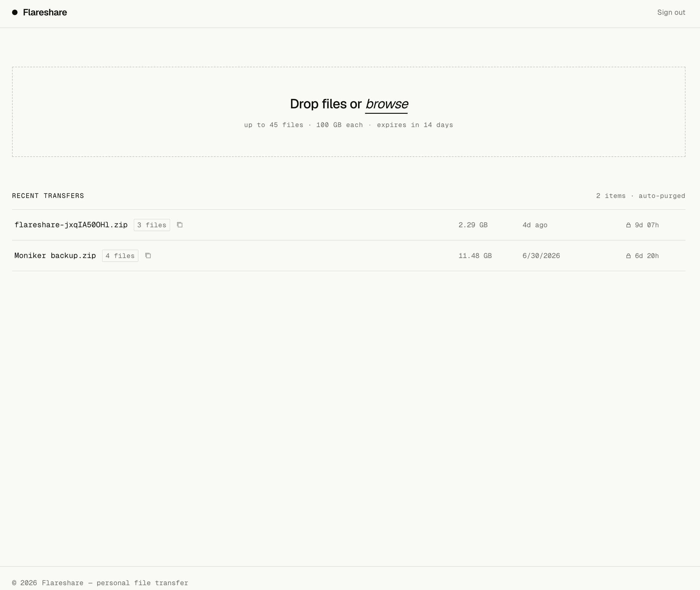
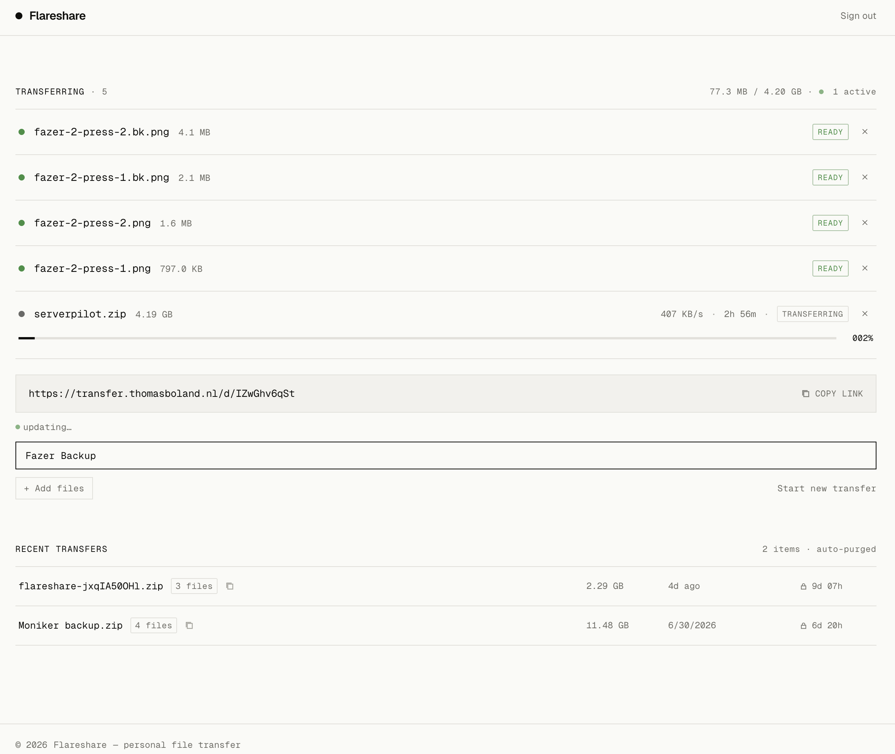

# Flareshare

A minimal, single-user file drop built on SvelteKit and Cloudflare. Upload files up to 100 GB, share a link, files auto-expire after 14 days. GitHub OAuth restricts uploads to one account; downloads are public capability URLs — no sign-in required.

Multiple files can be combined into a single bundle, sharing one link. The recipient downloads one streaming ZIP.

Most of this project was built with [Claude Code](https://claude.com/claude-code).

## Why

I used WeTransfer for years, but it's gotten worse: shorter retention windows, lower free file size limits, and more nagging upsells. The alternatives I looked at weren't much better, with bad UX like verification emails.

I only need this for myself: drop a file, get a link, send it, let it expire. So I built the smallest thing that does that, with no accounts for recipients, no artificial limits, storage cheap enough to not think about, hosted on infrastructure I already trust.

## Features

- Drag-and-drop or file-picker upload
- Files up to 5 GB via a single presigned PUT; up to 100 GB via multipart (64 MB parts, 4 concurrent)
- Multi-file bundles: up to 45 files per transfer, shared as one link, downloaded as a single streaming ZIP (no server-side compute over file bytes, so it scales the same as single-file downloads)
- Direct browser-to-R2 uploads — file bytes never pass through the Worker
- Public download links with no authentication
- Recent uploads list with copy-link and delete
- 14-day auto-expiry via R2 lifecycle rules
- GitHub OAuth gating — only your account can upload

## Screenshots

|                                       |                                       |
| ------------------------------------- | ------------------------------------- |
|  |  |

## Stack

- [SvelteKit](https://kit.svelte.dev) (Svelte 5) with `@sveltejs/adapter-cloudflare`
- [Cloudflare Pages](https://pages.cloudflare.com) for hosting + server routes
- [Cloudflare R2](https://developers.cloudflare.com/r2/) for object storage (zero egress)
- [`aws4fetch`](https://github.com/mhart/aws4fetch) for SigV4 presigned URLs (Worker-native, no AWS SDK)
- [GitHub OAuth](https://docs.github.com/en/apps/oauth-apps) for single-user authentication

See [docs/ARCHITECTURE.md](docs/ARCHITECTURE.md) for a detailed design walkthrough, and [docs/BUNDLES.md](docs/BUNDLES.md) for how multi-file bundles are streamed as ZIPs on Cloudflare's Free plan.

## Self-hosting

### Prerequisites

- A Cloudflare account with Pages and R2 enabled
- A GitHub OAuth App (Settings → Developer settings → OAuth Apps)
- Node.js 20+

### 1. Fork and clone

```bash
git clone https://github.com/<you>/flareshare
cd flareshare
npm install
```

### 2. Create an R2 bucket

In the Cloudflare dashboard, create a bucket (any name — you'll set it as `R2_BUCKET` below) and add a lifecycle rule: **expire objects after 14 days**.

Generate an R2 API token with **Object Read & Write** for that bucket.

### 3. Create a GitHub OAuth App

- Homepage URL: `https://<your-domain>`
- Callback URL: `https://<your-domain>/auth/callback`

Note the **Client ID** and **Client Secret**.

Find your numeric GitHub user ID:

```bash
curl https://api.github.com/users/<your-username> | grep '"id"'
```

### 4. Configure environment variables

```bash
cp .dev.vars.example .dev.vars
# fill in all values in .dev.vars
```

For production, set the same variables in the Cloudflare Pages dashboard under **Settings → Environment variables** (use **Secrets** for sensitive values).

### 5. Deploy

Connect the repo to Cloudflare Pages (or push to a branch linked to Pages). The build command is `npm run build`; the output directory is `.svelte-kit/cloudflare`.

### 6. Local development

```bash
npm run dev
```

The dev server runs at `http://localhost:5173`. Set the GitHub OAuth callback URL to `http://localhost:5173/auth/callback` for local testing (you can use a separate OAuth App or temporarily update the callback URL).

## Limitations

- Single-user only — one GitHub account can upload; there's no multi-tenant support
- Bundles are capped at 45 files (Cloudflare Free plan's 50-subrequest limit); individual file/bundle size is not capped beyond the 100 GB multipart ceiling
- No resumable or ranged downloads — an interrupted download restarts from zero
- No database — recent-uploads listing and expiry both rely on R2 object listing and lifecycle rules, so there's no history once an object expires

## Cost

R2 storage is ~$0.015/GB/month with zero egress charges. At this scale (single user, files auto-deleted after 14 days) the cost is effectively zero.

## License

[MIT](LICENSE)
